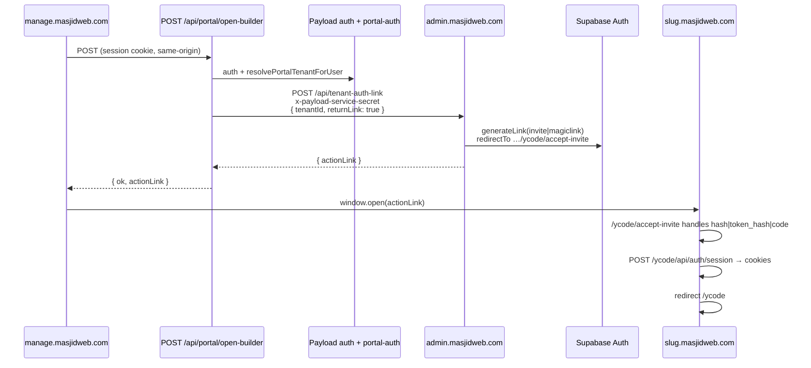

# Auth spike: manage portal + builder handoff

Phase 1 design for **tenant sessions on `manage.masjidweb.com`**, **platform vs tenant RBAC**, route split **`/admin` vs `/portal`**, and **magic-link bridge** into `{slug}.masjidweb.com/ycode` without breaking the fragile accept-invite flow.

Related docs:

- [ASTRO_API_FOR_PAYLOAD.md](./ASTRO_API_FOR_PAYLOAD.md) — admin JSON API contract
- [TENANCY.md](./TENANCY.md) — Supabase tenant isolation
- [PLATFORM-ROADMAP.md](./PLATFORM-ROADMAP.md) — Phase 1 portal hub plan

---

## Goals

1. **One origin for human admin UI:** `manage.masjidweb.com` (Payload) for platform staff and charity tenant admins.
2. **Headless ops execution:** `admin.masjidweb.com` (Astro) generates magic links, runs provisioning, core updates — not the primary UI long-term.
3. **Builder stays on tenant subdomain:** public site and YCode editor remain on `{slug}.masjidweb.com`; portal uses a **server-generated link**, not a shared cookie across domains.
4. **Tenant isolation:** a charity admin for tenant A must never receive a builder link for tenant B, even if they tamper with client requests.

---

## Two session domains (by design)

| Domain | Session | Purpose |
|--------|---------|---------|
| `manage.masjidweb.com` | Payload JWT / session cookie | Portal home, charity CRM (future), platform admin |
| `{slug}.masjidweb.com` | Supabase SSR cookies (YCode builder) | Visual builder, public SSR |

These cookies **do not** cross domains. The portal **“Open website builder”** button calls a manage API that asks Astro to generate a Supabase invite/magic link targeting **`https://{slug}.masjidweb.com/ycode/accept-invite`**.

---

## RBAC: platform vs tenant

Payload `users.role` (Phase 1):

| Role | Audience | `/admin/*` | `/portal/*` | Builder handoff |
|------|----------|------------|-------------|-----------------|
| `platform_admin` | MasjidWeb staff | ✅ full | ❌ (use ops console) | via ops `tenant-auth-link` with explicit tenant pick |
| `support` | MasjidWeb support | ✅ limited | ❌ | same as platform |
| `content_editor` | Platform content | ✅ CMS | ❌ | — |
| `charity_admin` | Tenant masjid/charity admin | ❌ | ✅ portal | **`POST /api/portal/open-builder`** (tenant from session only) |

**Platform staff** must not use the portal builder route — it resolves tenant from the logged-in user, not from a request body.

**Tenant portal users** (`charity_admin`) bind to a tenant via:

1. `users.tenantRegistryId` — Supabase `tenant_registry.id` UUID, or
2. `users.organisation` → `tenants` collection row → `ycode.tenantId`

Server-side resolution lives in `masjidweb-manage-payload/src/ops/portal-auth.ts` (`resolvePortalTenantForUser`).

---

## Route split: `/admin` vs `/portal`

| Path prefix | Host | Auth | Notes |
|-------------|------|------|-------|
| `/admin/*` | manage | Payload login | Platform CMS, ops console links, Payload collections |
| `/portal/*` | manage | Payload login | Tenant-facing shell: home, help, future donors/campaigns |
| `/api/portal/*` | manage | Payload session + same-origin POST | Server actions for portal (builder handoff) |
| `/api/ops/*` | manage | Payload session + platform admin | Mirrors Astro ops; explicit `tenantId` allowed for staff |
| `/api/*` (Astro) | admin | Session cookie **or** `x-payload-service-secret` | Headless execution layer |

Post-login redirect (Phase 1 sketch):

- `charity_admin` → `/portal/home`
- `platform_admin` / `support` → `/admin` or `/ops-console`

---

## Builder handoff flow



### Fragile accept-invite contract (do not change casually)

Source of truth: `admin-dashboard-v2/src/lib/send-tenant-auth-link.ts` and YCode:

- `ycode-mw-tenant/app/(builder)/ycode/accept-invite/page.tsx`
- `ycode-mw-tenant/app/(builder)/ycode/api/auth/session/route.ts`
- `ycode-mw-tenant/lib/supabase-cookie-domain.ts`
- `ycode-mw-tenant/proxy.ts`

Rules preserved by `sendTenantAuthLink`:

1. **Redirect target** for both invite and magic link: `{siteUrl}/ycode/accept-invite` (`buildTenantAuthRedirectUrls`).
2. **New users:** `inviteUserByEmail` → accept-invite → set password.
3. **Existing invited (no password):** `generateLink({ type: "invite" })` recovery.
4. **Existing completed users:** `generateLink({ type: "magiclink" })`.
5. **Portal uses `returnLink: true`** — no email sent; link returned to browser for `window.open`.
6. Accept-invite supports hash tokens, `token_hash` query, and PKCE `code` exchange; magic-link hash tokens POST to `/ycode/api/auth/session`.

---

## Integration code paths

### Manage (Payload)

| File | Role |
|------|------|
| `src/portal/open-builder.ts` | Core: session → tenant → admin API |
| `src/app/(payload)/api/portal/open-builder/route.ts` | Primary API route |
| `src/app/(payload)/api/portal/builder-link/route.ts` | Alias for Track B UI |
| `src/ops/portal-auth.ts` | Tenant resolution + RBAC helpers |
| `src/ops/admin-api-client.ts` | `requestTenantAuthLink` → Astro |

### Admin (Astro)

| File | Role |
|------|------|
| `admin-dashboard-v2/src/pages/api/tenant-auth-link.ts` | JSON endpoint |
| `admin-dashboard-v2/src/lib/send-tenant-auth-link.ts` | Link generation |
| `admin-dashboard-v2/src/lib/payload-service-auth.ts` | `x-payload-service-secret` validation |

---

## Environment

**manage.masjidweb.com** (Payload):

```env
ADMIN_API_BASE_URL=https://admin.masjidweb.com
PAYLOAD_SERVICE_SECRET=<16+ chars, shared with admin>
YCODE_TENANT_DOMAIN_SUFFIX=masjidweb.com
```

`ADMIN_API_BASE_URL` is preferred; `YCODE_ADMIN_URL` remains as fallback.

**admin.masjidweb.com** (Astro):

```env
PAYLOAD_SERVICE_SECRET=<same value>
PAYLOAD_PORTAL_ORIGINS=https://manage.masjidweb.com,http://localhost:3003
TENANT_DOMAIN_SUFFIX=masjidweb.com
```

---

## Tenant isolation checklist

Before shipping portal auth changes:

1. Portal builder API **never** accepts client-supplied `tenantId`.
2. `resolvePortalTenantForUser` must return the user's bound tenant only.
3. Astro `tenant-auth-link` still validates tenant exists in `tenant_registry` (service role).
4. Cross-tenant: charity admin for tenant A calling open-builder must not get tenant B link even if B's UUID is guessed.
5. Regression-test two active tenants A/B: portal A → builder A only; portal B → builder B only.

---

## Track B merge order

Track B adds `/portal/*` UI (shell, home, help). Track C adds integration **without requiring Track B files**.

Recommended merge:

1. **Track C first (or parallel):** `portal-auth.ts`, `admin-api-client.ts`, `/api/portal/open-builder`, this doc.
2. **Track B:** portal pages; `PortalClient` may call `/api/portal/builder-link` (alias) or `/api/portal/open-builder`.
3. **Wire UI:** point sidebar/button at either API path; both re-export the same handler.

If Track B lands before Track C, the stub at `/portal/open-builder` returned `501` until Track C replaces it with the live re-export.

---

## Manual test steps

### 1. Unit tests (manage)

```bash
cd masjidweb-manage-payload
npm test
```

Expect: `portal-auth`, `open-builder`, `admin-api-client` tests green.

### 2. Local integration (manage + admin)

```bash
# Terminal A — admin
cd masjidweb-backend/admin-dashboard-v2 && npm run dev

# Terminal B — manage
cd masjidweb-manage-payload && npm run dev
```

Set matching `PAYLOAD_SERVICE_SECRET` in both `.env` files.

1. Log in to manage as a `charity_admin` user with `tenantRegistryId` or organisation → tenant link.
2. Open `/portal/home` (or use curl with session cookie):

```bash
curl -s -X POST \
  -H "Cookie: payload-token=..." \
  -H "Origin: http://localhost:3003" \
  http://localhost:3003/api/portal/open-builder | jq
```

3. Expect `{ ok: true, actionLink: "https://..." }` with redirect eventually landing on `{slug}.masjidweb.com/ycode/accept-invite`.

### 3. Admin API direct (smoke)

```bash
curl -s -X POST \
  -H "Content-Type: application/json" \
  -H "x-payload-service-secret: $PAYLOAD_SERVICE_SECRET" \
  -d '{"tenantId":"<uuid>","returnLink":true}' \
  https://admin.masjidweb.com/api/tenant-auth-link | jq
```

### 4. Two-tenant MT validation

With tenants A and B active:

- Charity admin A: open-builder → link opens A subdomain only.
- Charity admin B: same for B.
- Platform admin: must use ops console / `/api/ops/tenant-auth-link` with explicit tenant pick, not portal route.

### 5. Accept-invite regression (subdomain)

For each returned `actionLink`:

- New/uninvited user → accept-invite → set password → `/ycode`.
- Existing user → magic link → accept-invite → `/ycode/api/auth/session` → `/ycode`.
- Refresh builder; session survives on subdomain.

---

## Open questions (Phase 2+)

- Provision email: point to `manage.masjidweb.com/login` first vs subdomain accept-invite bootstrap.
- Separate Payload vs Supabase auth for tenant login (currently Payload-only for portal).
- `content_editor` access to tenant-scoped CMS without full portal.

---

*Last updated: Phase 1 Track C — integration + docs spike.*
