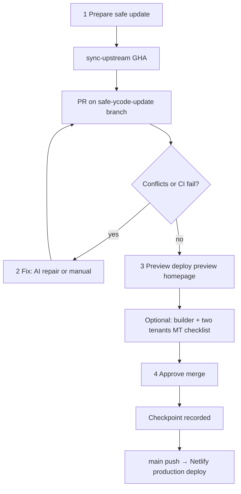

# Core update workflow (MasjidWeb)

This document defines the **full-proof safe Ycode core update system** for MasjidWeb: update upstream Ycode, preserve fragile MasjidWeb customizations, and recover when something goes wrong.

Related:

- Builder repo: `ycode-mw-tenant/docs/masjidweb-core-seams.md` (what must not break)
- Builder repo: `ycode-mw-tenant/docs/core-update-process.md` (fork rules)
- `MT_VALIDATION_CHECKLIST.md` (manual two-tenant smoke)
- `UPSTREAM_MERGE_HOTSPOTS.md` (high-risk files)

---

## Three goals

| # | Goal | How the system addresses it |
|---|------|-----------------------------|
| 1 | **Update Ycode core** | Isolated branch + PR from `sync-upstream.yml`; never direct merge to `main` from admin |
| 2 | **Preserve tenant isolation, auth, fragile flows** | Seam tiers, safety classifier, PR CI (type-check, tenant tests, build), deploy preview, manual MT checklist |
| 3 | **Reverse to pre-update state** | Checkpoint on approve + **Full rollback** (git revert + exact Netlify deploy restore) |

---

## Forward path (always use this)

### Step details

1. **Prepare** — Admin Maintenance → **Prepare safe update** → GitHub Actions `Create safe Ycode update PR` (`sync-upstream.yml`).
2. **Fix** — Only if merge conflicts or CI fails. Use **Retry Autopilot** for deterministic repair, or **Escalate to Copilot** to dispatch `ai-repair-safe-update.yml` with `copilot_escalation_mode=issue`. Use **Assign Copilot** only when the repository has GitHub Copilot coding agent enabled. Do not approve while blocked.
3. **Preview** — Open **homepage preview** on Netlify deploy preview (not `{slug}.masjidweb.com`). Optionally test `/ycode` builder login.
4. **Approve** — **Approve merge** when CI is green and preview looks good. Records a **reversible checkpoint** (see below).

### Automated gates (PR CI)

On every safe-update PR:

- `npm run type-check`
- `npm run updates:safety-check` (Autopilot v2 LOW/MEDIUM/HIGH risk report)
- `npm run updates:autopilot-guard` (conflict-marker and tenant-scope invariant guard)
- Tenant vitest suite (isolation, auth store, MCP, repositories)
- `npm run build`
- Netlify deploy preview

### Autopilot v2.2 deterministic repair

Autopilot v2.2 is a conservative guardrail and deterministic repair layer, not an unsafe auto-merge bot.

It produces three artifact families in GitHub Actions:

- `update-safety-report.md/json` — machine-readable classification and plain-English summary.
- `autopilot-repair-report.md/json` — deterministic repair attempts, repaired files, blocked files grouped by reason (`known-resolver-unavailable`, `tenant-invariant-failed`, `conflict-markers-remain`), exact missing invariants, and dashboard-friendly next action text.
- `autopilot-guard-report.md/json` — deterministic guard results for conflict markers and tenant invariants.
- Copilot escalation request — optional, gated PR comment or GitHub issue containing a constrained repair prompt when deterministic repair blocks.

Risk levels:

| Risk | Meaning | Dashboard behavior |
|---|---|---|
| LOW | No tenant-sensitive paths or conflicts detected. | Continue normal CI and preview. |
| MEDIUM | Tooling/config/UI/lockfile risk, or non-tenant conflict. | Autopilot may retry mechanical repair; still wait for CI. |
| HIGH | Tenant-sensitive paths such as repositories, publish, auth, proxy, Supabase cookie/session, collection items, or migrations. | If conflicted, the dashboard says “Autopilot blocked this update to protect tenant data” and requires a developer. |

Deterministic repair and guard behavior:

- Detects unmerged paths with `git diff --name-only --diff-filter=U` and conflict-marker scans.
- Regenerates `package-lock.json` mechanically with npm lockfile-only from `package.json`; if npm tries to modify `package.json`, Autopilot blocks for developer review.
- Blocks when conflict markers remain in tenant-sensitive files.
- Checks known repository/publish/auth/proxy/Supabase-cookie plus v2.2 `lib/page-fetcher.ts` and `lib/services/collectionService.ts` for tenant-scope invariants such as `tenant_id`, `applyTenantEq`, `resolveEffectiveTenantId`, `getTenantIdFromHeaders`, `runWithEffectiveTenantId`, and no invalid `getSupabaseAdmin(tenantId)` calls.
- For high-risk repository/publish/page-fetcher/collection-service seams, fails closed unless a registered deterministic strategy can prove the required tenant-scope invariants. The report names the exact missing invariant and why it cannot auto-repair.
- v2.2 does not broad-merge `lib/page-fetcher.ts` or `lib/services/collectionService.ts`; it gives exact classification for missing host/subdomain tenant resolution, untenant-scoped service-role table reads, missing Knex tenant filters, remaining conflict markers, or missing seam resolver extraction.
- Does not perform broad text munging in tenant-sensitive files.

### Optional Copilot escalation

When deterministic repair blocks, an operator may rerun `ai-repair-safe-update.yml` with `copilot_escalation_mode` set to one of:

- `comment` — update or create one idempotent PR comment with a paste-ready constrained repair prompt.
- `issue` — also create or update a GitHub issue using the same prompt.
- `assign` — create/update the issue and assign it to `@copilot` when GitHub Copilot coding agent is enabled for the repository.

The default is `none`. Repository variable `ENABLE_COPILOT_ESCALATION=true` enables the PR-comment path for blocked repair runs, but issue creation and `@copilot` assignment still require the explicit workflow input. This path never approves, marks ready, or merges a PR. Any Copilot commit must pass `npm run updates:autopilot-guard`, `bash scripts/check-tenant-isolation.sh`, `npm run type-check`, `npm run build`, normal PR CI, preview review, and the applicable multi-tenant checklist before approval.

GitHub CLI currently supports issue assignment to Copilot through `gh issue create --assignee "@copilot"`. If the repository or organization does not have Copilot coding agent enabled, use `comment` or `issue` mode and manually assign the prepared issue from GitHub.com.

### What “preserve custom code” means

MasjidWeb customizations live in:

- **Tier 0** — `lib/masjidweb/*` (preferred; rarely touched by upstream)
- **Tier 1–2** — `proxy.ts`, repositories with `applyTenantEq`, cookie domain helpers
- **Tier 3–5** — cache/publish services, auth routes, accept-invite (fragile)

The safe-update PR **merges upstream into a branch that already contains MasjidWeb seams**. Conflict resolution must **re-apply seams**, not delete tenant scoping. See `masjidweb-core-seams.md`.

**High-risk label (`tenant-sensitive-update`) is advisory** — you can still approve when mergeable + CI green. Treat it as “extra manual review required,” especially for auth/proxy/publish paths.

### Manual gate (required for fragile flows)

Before approve on any update that touches Tier 1–5 files, run **`MT_VALIDATION_CHECKLIST.md`** on deploy preview:

- Two tenants A/B — public homepages, builder pages list, no cross-tenant data
- Magic-link / accept-invite / session refresh (if auth files changed)
- One publish per tenant

---

## Reversal paths

### A. Deploy-only rollback (fast, partial)

**Maintenance → Restore previous live build**

- Restores the **previous Netlify production deploy**
- Does **not** revert git `main`
- Use when: bad build but you have not merged yet, or you need instant relief while preparing full rollback

### B. Full rollback (git + deploy aligned)

**Maintenance → Full rollback to pre-update** (visible when a checkpoint exists)

Triggered after **Approve merge** recorded a checkpoint:

| Field stored | Purpose |
|--------------|---------|
| `before_main_sha` | Git state before merge |
| `before_deploy_id` | Exact Netlify production deploy before merge |
| `before_package_version` | Builder semver at that commit |
| `pr_number` | Safe-update PR to revert |

**Full rollback does:**

1. GitHub **revert PR** for the merged safe-update PR → merge revert to `main`
2. Netlify **restore** the stored `before_deploy_id`

**Result:** Live production matches pre-approve **code + deploy**. Git `main` matches reverted code (no “ahead of deployed” drift).

### C. What full rollback does NOT reverse

| Layer | Reversed? | Notes |
|-------|-----------|-------|
| Git builder code | Yes | via revert PR |
| Netlify production runtime | Yes | via stored deploy id |
| Supabase tenant CMS/pages | No | Data is not in git |
| Postgres schema migrations | No | If update added migrations, plan manual down migration |
| Supabase Auth users/sessions | No | Existing sessions may need re-login after major auth changes |

For migrations: review `database/migrations/` in the PR **before approve**. If migrations ran in shared DB, document a down path before merging.

---

## Checkpoint storage

Table: `core_update_audit_log` (Supabase migration `20260521120000_core_update_audit_log.sql`)

Actions:

- `approve_merge` — written on successful approve
- `rollback_full` — written after full rollback (invalidates checkpoint for repeat rollback)
- `rollback_deploy` — reserved for deploy-only audit (future)

Apply migration in Supabase before relying on full rollback in production admin.

---

## Operator checklist

### Before approve

- [ ] PR CI green on GitHub
- [ ] Deploy preview homepage loads for MasjidDemo1 (or chosen tenant)
- [ ] If high-risk / tenant-sensitive: MT checklist on preview
- [ ] If migrations in PR: down migration plan documented

### After approve

- [ ] GitHub workflow **Core update production deploy** completes (emails repo watchers with Actions notifications enabled)
- [ ] PR comment confirms Netlify production is live
- [ ] Spot-check live tenant subdomain + builder login
- [ ] If problems: **Full rollback to pre-update** (not deploy-only, unless emergency seconds matter)

### Never do for production

- One-click “sync fork” on GitHub without review
- `POST /api/updates/apply-builder-update` (legacy direct path)
- Approve while merge conflicts or CI failing
- Test update on `{slug}.masjidweb.com` (always production `main`, not PR code)

---

## File map

| Area | Path |
|------|------|
| Admin wizard UI | `admin-dashboard-v2/src/pages/dashboard/maintenance.astro` |
| Approve + checkpoint | `admin-dashboard-v2/src/pages/api/updates/approve-safe-update.ts` |
| Full rollback API | `admin-dashboard-v2/src/pages/api/updates/rollback-full-update.ts` |
| Checkpoint lib | `admin-dashboard-v2/src/lib/core-update-audit.ts` |
| Create safe PR workflow | `ycode-mw-tenant/.github/workflows/sync-upstream.yml` |
| PR CI | `ycode-mw-tenant/.github/workflows/ci-build-check.yml` |
| Deploy complete notification (GitHub) | `ycode-mw-tenant/.github/workflows/core-update-deploy-notify.yml` |
| Safety classifier | `ycode-mw-tenant/lib/masjidweb/update-safety-check.ts` |
| Safety CLI | `ycode-mw-tenant/scripts/check-update-safety.ts` |
| Autopilot deterministic repair CLI | `ycode-mw-tenant/scripts/core-update/run-autopilot-repair.ts` |
| Copilot escalation CLI | `ycode-mw-tenant/scripts/core-update/create-copilot-escalation.ts` |
| Autopilot guard CLI | `ycode-mw-tenant/scripts/check-autopilot-guard.ts` |
| Seam contract | `ycode-mw-tenant/docs/masjidweb-core-seams.md` |

---

## Honest definition of “100% same state”

**100% for builder runtime:** git revert + Netlify deploy restore to checkpoint → same code and same compiled deploy as before approve.

**Not 100% for the whole platform** unless you also handle DB migrations and accept that tenant content in Supabase was never part of the update artifact.

Design updates so **forward path is gated** and **backward path restores both git and Netlify** — that is what this workflow implements.
